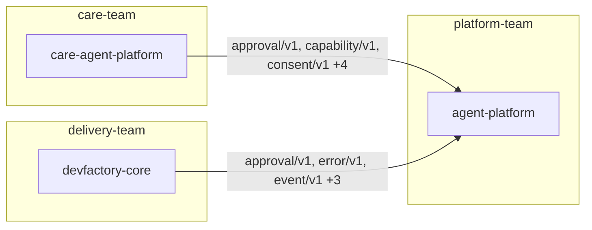

# Impact Analysis (M4)

> ตอบว่า "เปลี่ยนสิ่งนี้แล้วแผ่ไปถึงไหน" โดยแยกสามชั้นให้ชัด
> **graph** ใครขึ้นกับใคร · **change** breaking หรือไม่ · **cross-team** ใครต้องทำอะไร

```bash
make graph COMPONENT=agent-platform          # ใครกระทบถ้าเปลี่ยนตัวนี้
make graph COMPONENT=devfactory-core DIR=up  # ตัวนี้ขึ้นกับใคร
make impact CONTRACT=approval/v1 LEVEL=breaking
make impact PR=agent-platform#35             # วิเคราะห์จาก diff จริง
make mermaid
```

## Graph ที่คนอ่านรู้เรื่อง (#18)

```text
agent-platform
├── care-agent-platform  (approval/v1, capability/v1, consent/v1, error/v1, event/v1, identity/v1, policy/v1)
└── devfactory-core      (approval/v1, error/v1, event/v1, execution/v1, identity/v1, policy/v1)
```

เส้นทุกเส้นบอกด้วยว่าเชื่อมกันผ่าน **contract ตัวไหน** — ไม่ใช่แค่ว่า "พึ่งพากัน"
วงกลมที่เดินซ้ำถูกทำเครื่องหมาย `↺` แล้วหยุด ไม่วนไม่รู้จบ



## breaking / non-breaking / **ไม่แน่ใจ** (#19)

ชั้นนี้ยากที่สุด และเป็นชั้นเดียวที่ **ยอมตอบว่าไม่แน่ใจได้**
การเดาว่า non-breaking แล้วผิด แพงกว่าการบอกว่าไม่แน่ใจแล้วให้คนดู

| สัญญาณใน diff | ระดับ | เหตุผล |
| --- | --- | --- |
| เพิ่ม property ที่ไม่อยู่ใน `required` | 🟢 non-breaking | ของเดิมยังผ่าน validation |
| ไฟล์ contract ใหม่ | 🟢 non-breaking | การเพิ่มไม่ทำให้ของเดิมพัง |
| **เพิ่ม** field ใน `required` | 🔴 breaking | payload เดิมของ consumer ตกทันที |
| ถอด property | 🔴 breaking | consumer ที่อ่าน field นั้นพัง |
| เปลี่ยน `type` ของ field เดิม | 🔴 breaking | |
| ถอดค่าออกจาก `enum` | 🔴 breaking | |
| ลบไฟล์ contract | 🔴 breaking | |
| **ถอด** field ออกจาก `required` | 🟡 ไม่แน่ใจ | ผู้ผลิตไม่พัง แต่ผู้บริโภคที่คิดว่าต้องมีเสมออาจพัง |
| `contract-semantics.yaml` | 🟡 ไม่แน่ใจ | schema ไม่ขยับ แต่ความหมายเปลี่ยนได้ |
| `decisions/` `rfcs/` | 🟡 advisory | เปลี่ยนความหมายได้ แต่ถ้ามี schema diff ให้ดู ให้เชื่อ schema |
| สัญญาณไม่ชัด | 🟡 ไม่แน่ใจ | ให้คนอ่าน |

**advisory ไม่ตัดสินแทน schema** — PR ที่แก้ ADR พร้อมกับเพิ่ม optional field
ไม่ควรถูกตีเป็น "ไม่แน่ใจ" ทั้งใบ ทั้งที่ diff ของ schema บอกชัดแล้ว

### เทียบกับที่ผู้เขียนประกาศเอง

CHANGELOG ของ contract ใน ecosystem นี้มักเขียนเองว่า breaking หรือไม่
ระบบอ่านคำประกาศนั้นมาเทียบกับผลจาก diff — **ไม่ตรงกันเมื่อไหร่ก็บอก**

อ่านเฉพาะจาก `contracts/*/CHANGELOG.md` เท่านั้น เพราะเอกสารทั่วไปพูดถึงคำว่า
breaking ในเชิงอธิบายนโยบายได้ ไม่ใช่คำประกาศเกี่ยวกับ PR นั้น
(รอบแรกที่อ่านทุกไฟล์ ระบบแจ้ง disagreement ผิดทันที)

### ผลจริงกับ PR จริง

```text
$ make impact PR=agent-platform#35
🟢 NON-BREAKING
  [non-breaking] contracts/approval/v1/approval.schema.yaml
                  · เพิ่ม optional property อย่างเดียว: correlation_id
  [non-breaking] contracts/execution/v1/execution.schema.yaml
                  · เพิ่ม optional property อย่างเดียว: approval_id
  [unsure] (advisory) decisions/0019-execution-records-its-approval.md
```

ตรงกับที่ CHANGELOG ของ PR นั้นเขียนไว้เองว่า *"ไม่ breaking — เพิ่ม optional field อย่างเดียว"*

## Cross-team (#20)

ลำดับการประสานงานไม่ได้มาจากความสุภาพ แต่มาจาก **ใครมีอำนาจตัดสินใจ และใครพังก่อน**

| ลำดับ | ใคร | ทำไมต้องก่อน |
| --- | --- | --- |
| 0 | เจ้าของ **semantics** | ADR-0006 C2 — แก้ที่ `authority` ฝ่ายเดียวไม่ได้ |
| 1 | consumer ที่ conformance ยังไม่ `passing` | ไม่มีใครรู้ว่าเขาจะพังตรงไหน |
| 2 | consumer ที่เหลือ | `blocking` ถ้า breaking · `notify` ถ้าไม่ |
| 3 | ทีมที่แค่ประกาศเจตนา (`expected_by`) | `fyi` — ยังไม่พัง แต่แผนอาจต้องปรับ |

### ร่าง issue — ร่างเท่านั้น

การเปิด issue ใน repo ของทีมอื่นย้อนยากและเป็นเรื่องของคน
ระบบเตรียมหัวข้อและเนื้อหาให้พร้อม (รวม commit ที่ pin อยู่และสถานะ conformance)
แล้วจบแค่นั้น ทุกร่างลงท้ายด้วย `_ร่างโดย ecosystem-intelligence — ยังไม่ได้เปิด issue ให้_`

## กฎ vs ความเห็นของ model

| | มาจาก | ใช้ตอนไหน |
| --- | --- | --- |
| `/contracts/…/cross-team` (M4) | **กฎ** deterministic | ต้องการคำตอบเดิมทุกครั้ง ตรวจสอบย้อนได้ |
| `/contracts/…/coordination` (M2) | **model** ผ่าน LLM | ต้องการคำอธิบายเป็นภาษาคน |

สองอันนี้ทับกันโดยตั้งใจ — มีเทสต์ที่บังคับว่าทั้งคู่ต้องให้ลำดับเดียวกันสำหรับ
`approval/v1` ถ้าวันหนึ่งไม่ตรงกัน แปลว่าอันใดอันหนึ่งผิด และเราจะรู้ทันที
